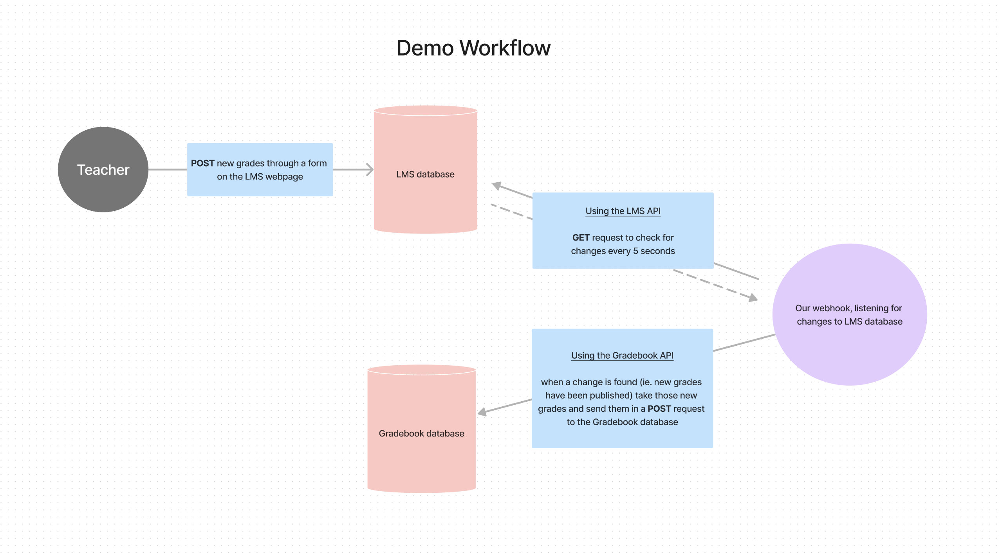

# ISMOWP

> *Lead Developer*: **Srinitya Chirravuri**  
> *Mentor*: **Victor Bezak**

The traditional workflow for teachers to manage student grades at Frisco ISD requires them to login and submit grades into two different platforms. Srinitya wanted to find a way to make teacher's lifes easier by automating this so that teachers only need to worry about submitting grades in one place, yet still have both platforms stay in-sync with the latest grades. In order to engineer a solution for this problem, we realized we would need to get permission to access both of the platforms that teachers are using for this today so we could experiment and test our potential solution. However, we were unable to get permission to access the real LMS and Gradebook platforms used by Frisco ISD teachers, so we decided to we would have to build our own frontend services and API's to emulate these 2 platforms. In order to do this, Srinitya had to learn many new concepts and skills that she otherwise would not have had to think about. The scope of our project suddenly tripled, but with time and determination on our side, we set off to make it happen one step at a time.

## Early Meetings, Discussion, and Planning

We started off discussing our idea at a high level. We used Figma to diagram different workflow ideas, and dedicated entire days to just learning fundamental concepts that we would need before we could progress. Over a period of weeks and months we chipped away at the skills required to make this work.

- Early Meeting Notes: [Google Doc](https://docs.google.com/document/d/1JYcI88rRG2PnXN3cJTITlANWqncOx9AgFqFF4rQDYA0/edit?usp=sharing)
- Figma diagrams: [Diagrams](https://www.figma.com/file/1amR8tbbCIENAlShwifKxo/Thought-process?type=whiteboard&node-id=0%3A1&t=4O4KbjwJMDEuDQSW-1)

Ultimately, we ended up with a complete body of work that included two frontend services, each with their own API and database, and one custom integration service. Our integration service performs short-polling to monitor for updates to the first platform, and automatically propagates those updates to the second platform whenever they occur. This result successfully demonstrates the ability to keep two grade management systems in-sync while only manually inputting grades into one of them.

## Frontend Development

We used basic HTML, Javascript and CSS to build 2 simple webpages. Each webpage uses a single local CSV file to keep track of its data. We opted for this simple database implementation to limit the scope of the project, however everything was designed in such a way that the CSV database could easily be replaced with a SQL server or other database technology.

Both webpages feature a table that lists all of the published grades in its system, but only the LearningManagementSystem webpage has a form through which you could pubish new grades.

## API Development

You'll notice in our LearningManagementSystem platform we only have 2 API endpoints:

- `POST /grades` a private endpoint used only by our application whenever the user makes a form sumbission through the frontend.
- `GET /grades` a public endpoint available for external use to retrieve all of the submitted grades.

And in our GradeBook platform, we only have a single API endpoint:

- `POST /grades` a public endpoint which allows you to enter new grades into their system via API

In-reality, these frontend platforms will have many more endpoints available to use, but for our demonstration, we only needed to recreate a couple of them.

For example:

- [Canvas API documentation](https://canvas.instructure.com/doc/api/all_resources.html)
- [Frisco ISD HAC API documentation](https://friscoisdhacapi.vercel.app/home)

> It's also important to note, that when you use someone else's APIs, you can't guarantee that they'll have the endpoints available that you'd need to do something like this. Our Demo is emulating a situation in which both platforms you're trying to keep in-sync have the necessary public GET and POST endpoints available for use.

## Skills Learned for Project

- How to create a `Node.js` project and manage its dependencies with `npm`
- `HTML` basics
    - tags: \<head>, \<body>, \<h1>, \
, \<a>, \ , \, \<ul>, \<li>, \<form>, \<label>, \<select>, \<option>, \<input>
    - how tag attributes work: selected, disabled, etc.
    - how to use \<script> tags to add javascript and \<style> tags to add CSS
- `CSS` basics
- `Javascript` basics: variables, functions, loops, arrays, string manipulation, DOM manipulation
- `Asynchronous Javascript`: how to use both .then/.catch and async/await syntax for handling asynchronous javascript operations
- `HTTP protocol` and status codes
- Prinicples of `REST API` design
- How to use `express.js` to build API servers and routes/endpoints
- How to use `Github` to host a project repository
- How to collaborate with other devs in Github by opening or reviewing `pull-requests`
- `git command-line` basics to manages changes between your local repo and your github repo: status, log, push, pull, remote, branch, checkout, add, commit
- Exposure to the concept of `short-polling`

## To Launch Demo

1. Perform an `npm install` in both `./LearningManagementSystem` and in `./GradeBook` to install their dependencies
2. In vscode, install the "Live Server" extension and start it
3. In one tab, open the LearningManagementSystem (http://127.0.0.1:5500/LearningManagementSystem/), and in another tab open the GradeBook (http://127.0.0.1:5500/GradeBook/)
4. Open 3 terminal instances, and from the ISMOWP directory, launch each index.js file:
    - `node ./LearningManagementSystem/api/index.js`
    - `node ./Gradebook/api/index.js`
    - `node ./integration/index.js`
5. Enter grades through the LearningManagementSystem form, and watch the logs of your integration server detect the change before pushing the new grades to the Gradebook database to keep them in-sync. Your Gradebook webpage should refresh automatically, but if it does not, perform a manual refresh to see the new grades appear.

---
---

## Recording of Demonstration

> Note: Jitteriness in the frontend pages reloading is due to the way our Live Server extension is configured. Whenever we push new data to either of our frontend databases, both webpage performs a hot-reload. That's why we seem them both refresh twice for each one change we make. We intentionally left this in as a trade-off so that we don't have to manually refresh the Gradebook to see our changes appear.

[click here to download recording of demonstration](./images/ismwop-demo-recording.mp4)

> System Diagram

